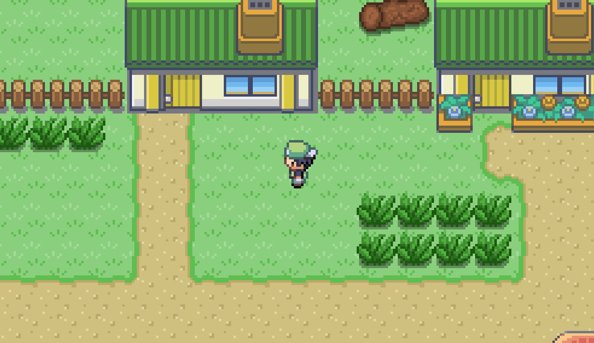
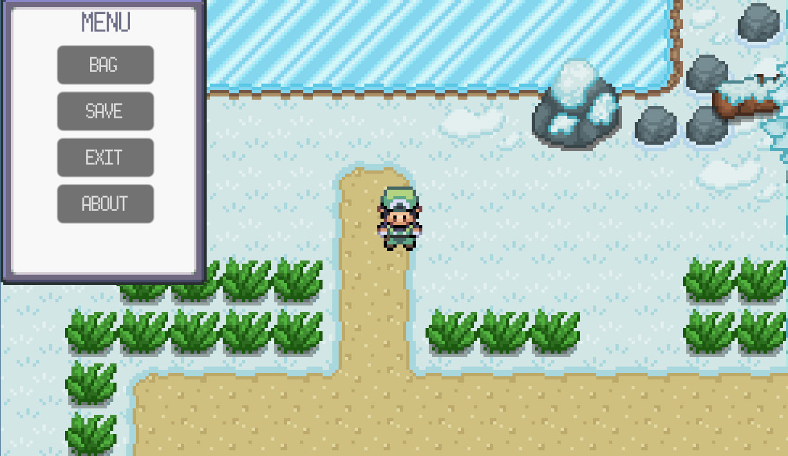
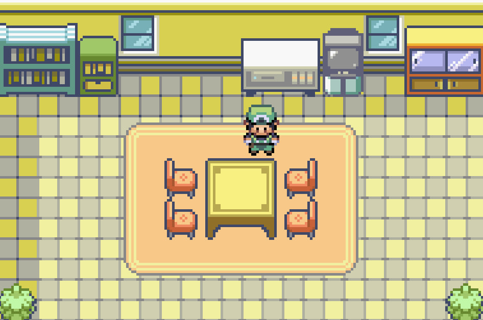
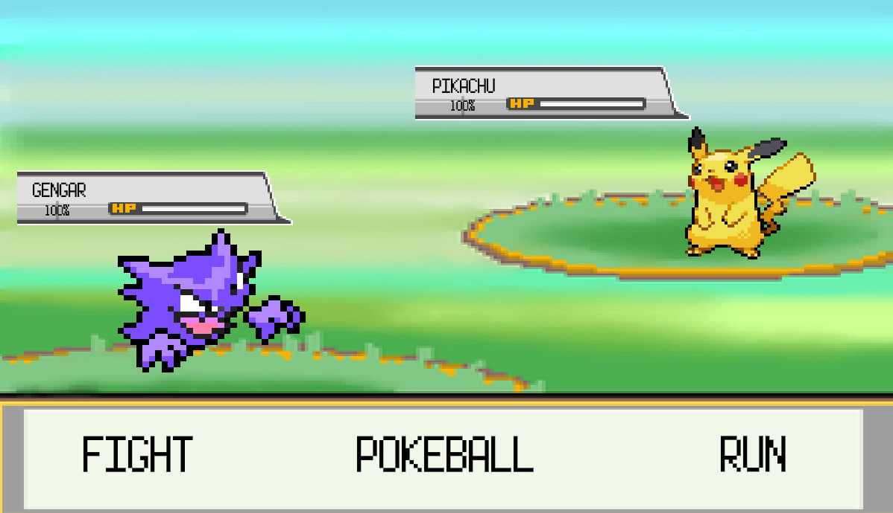
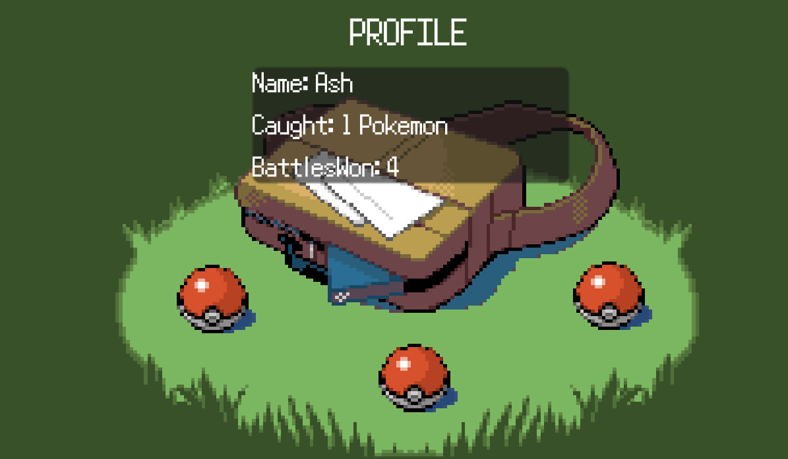

# Pokemon Godot Version

**University project | Non-commercial | Study use only | Windows platform**

A Pokemon-inspired game built with Godot Engine, featuring exploration, random encounters, and turn-based battles.

**To download game go to Releases "Download game" -> Download Pokemon.GodotVersion.zip -> open folder -> extract all files from .zip folder -> run .exe file -> enjoy)**

---
## Screenshots

### City


### Menu


### House


### Battle


### Profile

---

## Tech Stack

- **Engine**: Godot Engine 4.4.1 (Mono version)
- **Language**: C# (.NET 8.0 SDK)
- **IDE**: Visual Studio Code
- **Audio**: 8-bit style sound effects and music

---

## Prerequisites

Before running the project, ensure you have:

1. **Godot Engine 4.4.1 (Mono)** - [Download here](https://godotengine.org/download/windows/)
2. **.NET 8.0 SDK** - [Download here](https://dotnet.microsoft.com/en-us/download/dotnet)
3. **Visual Studio Code** (optional, for code editing)

---

## Installation & Running in Godot Game Engine App

1. Clone or download this repository
2. Open Godot Engine 4.4.1 (Mono version)
3. Click "Import" and select the `project.godot` file
4. Once imported, click "Run" or press `F5` to start the game

---

## Game Structure

### Main Scenes

The game consists of three core scenes created with Godot editor:

- **main_menu.tscn** - Starting menu screen
- **small_town.tscn** - Main overworld map
- **battle_scene.tscn** - Turn-based battle interface
- **[nameOfHouses].tscn** - Individual house interior scenes

### World (Small Town)

- Multiple interactable houses with unique interiors
- Environment featuring trees, cave, fences
- Weather conditions
- Collision detection with all objects
- Scene triggers at door entrances for seamless transitions


### Player Mechanics

- **Movement System**: 8x8px grid-based collision detection
  - Movement (up, down, left, right)
  - The main idea for walk is via C# code we check next to the player 8x8px squares to collide with objects
- **Position Persistence**: Returns to exact position after battles/houses
- **Scene Transitions**: Automatic scene changes via scene triggers

---

## Battle System

### Pokemon

- **Player Pokemon**: Haunter
- **Wild Pokemon**: Pikachu, Rattata, Squirtle
- **Encounter System**: Hidden grass triggers initiate random battles

### Battle Options

Three buttons:

1. **Fight** - Attack enemy Pokemon (turn)
2. **Catch** - Attempt to catch enemy Pokemon
3. **Run** - Leave from battle and return to previous position

### Battle Flow

- Player attacks first, then enemy attacks (turn)
- Battle ends when Pokemon is caught, defeated, or player runs
- Player returns to previous position after the battle

---

## UI Systems

### Menu (ESC key)

- **Bag** - View player stats
  - Player name
  - Number of caught Pokemon
  - Total battles won
- **Save** - Save current game state to JSON file
- **About** - Developer information
- **Exit** - Close game without saving

### Inventory Display

Shows real-time player statistics:
- Player name
- Caught Pokemon count
- Win counter

---

## Controls

 **Arrow Keys** Move player (↑ ↓ ← →)
 **Mouse** Start game / Interact with battle buttons
 **ESC** Open/close menu, close inventory/about screen

---

## Save System

### Features

- JSON save files
- Opens via ESC menu → Save button
- Preserves complete game state

### Saved Data

- Player position (Vector2)
- Battles won (int)
- Current scene (string)
- Caught Pokemon (int)

---

## Architecture

### Game Manager (Singleton)

// Core game state data
- PlayerPosition: Vector2      // Last known position
- BattlesWon: int               // Win counter
- CurrentScene: string          // Scene names

### Scene Transition System

GoTo(sceneName)              // Scene changer
GoToBattle(position)         // Battle scene
GoBack()                     // Return from battles/houses to small_town

### Save/Load System

SaveGame()    // Serializes current game state to JSON
LoadGame()    // Deserializes and restores saved state

### Battle Manager

playerAttack()     // Player attack with turns waiting for enemy attacks
catchPokemon()     // Attempt to catch enemy Pokemon
runFromBattle()    // Exit battle and return to small_town scene

---

## Scene Triggers

### Houses

- Triggers positioned at door entrances
- Changes scene to corresponding house interior

### Battles

- Hidden triggers placed in grass areas
- Returns player next to the trigger position after battle concludes

---

## Project Structure

```
PokemonGodotVersion/
├── addons/
├── assets/
├── resources/
├── scenes/ .tscn 
├── scripts/ c# files
├── other files/
```

---


## Credits

**University Project**  
InSleepModeDev
Developed for educational purposes  
© 2025 - Study use only

---


